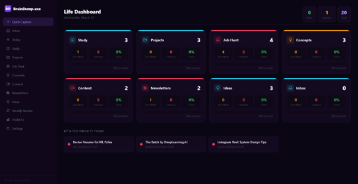
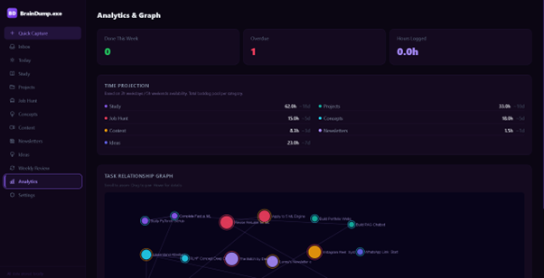
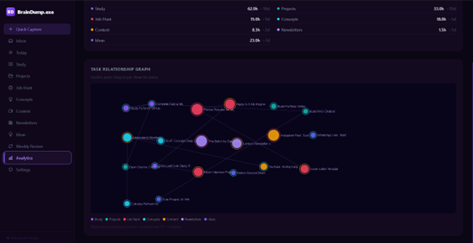

# BrainDump.exe

<p align="center">
  
  
  
</p>

A minimalist daily activity tracker for planning, prioritizing, and reviewing your work.

It helps you capture tasks quickly, organize them by category, and focus on what matters today.

## What it does

- Quick capture new tasks into Inbox
- Organize tasks across categories (Study, Projects, Job Hunt, Concepts, Content, Newsletters, Ideas)
- Prioritize work using a score: `(Importance × Impact × Urgency) / Effort`
- Use Kanban-style category boards to move work across statuses
- See a focused Today view and weekly review
- Open Focus Mode for deep work on a single task
- Auto-saves everything in browser `localStorage`

## Tech

- React
- Vite
- Inline-styled UI (no extra UI library)

## Run locally

```bash
npm install
npm run dev
```

Then open the local URL shown in terminal (usually `http://localhost:5173`).

## Build

```bash
npm run build
npm run preview
```

## Notes

- No backend required
- Data stays on your machine (browser storage)
- "Reset to Demo Data" is available inside Settings
